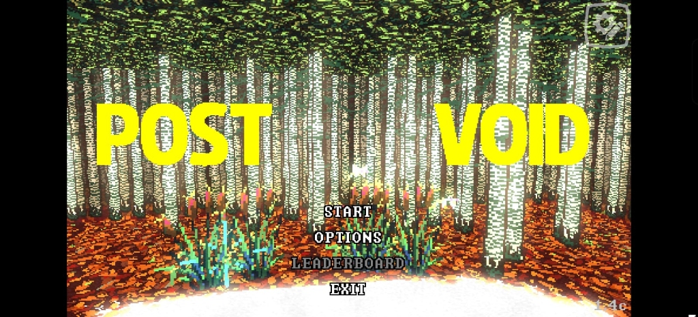
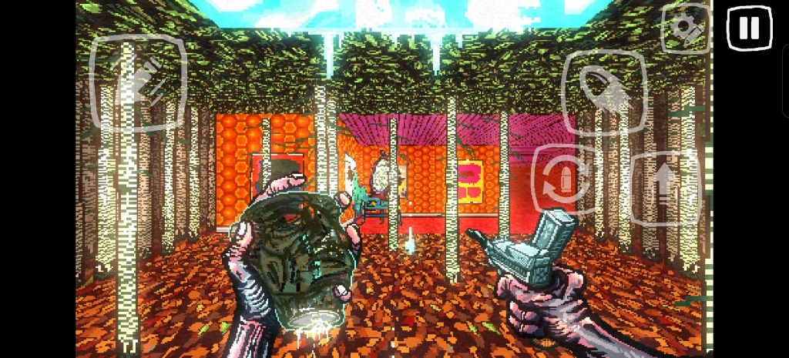
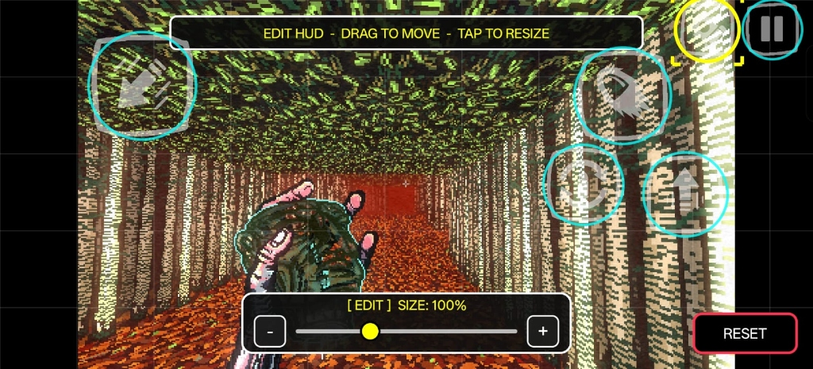

# PostVoid Mobile

<p align="center">
  
</p>

<p align="center">
  <a href="https://github.com/SanGraphic/PostVoidMobile/releases"></a>
  <a href="https://store.steampowered.com/app/1288700/POST_VOID/"></a>
  <a href="https://github.com/SanGraphic/PostVoidMobile/actions"></a>
  <a href="#graphical-api--hardware-requirements"></a>
  <a href="#credits--acknowledgements"></a>
</p>

An authentic, ultra-high-performance mobile port of **[POST VOID](https://store.steampowered.com/app/1288700/POST_VOID/)** for **Android** (with an **iOS release coming soon!**).

Built directly upon native mobile architectures with **zero emulation overhead**, delivering 1:1 gameplay parity with the latest upstream Steam release (**v1.4C**), smooth full-speed performance, custom hand-crafted touch controls with a real-time HUD editor, and full controller wired or wireless support.

---

## Quick Start Setup

> **Note:** This project uses a Bring Your Own Data (BYOD) model. You must own the original PC game on Steam. No copyrighted game assets are hosted or distributed in this repository.

1. **Download latest release and install APK**: Grab the latest release APK from the [Releases](https://github.com/SanGraphic/PostVoidMobile/releases) page.
2. **Buy Post Void on Steam and copy your game files**: Buy [POST VOID on Steam](https://store.steampowered.com/app/1288700/POST_VOID/) and copy your Steam game installation directory from your PC (`.../steamapps/common/Post Void`) into your device storage (e.g. `/sdcard/postvoid` or `Download/postvoid`).
3. **Open app and grant storage access**: Launch the app on your device and grant storage permissions when prompted so it can access your game files.
4. **Select game folder & play**: Tap "AUTO-PATCH & LAUNCH" or select your game folder/`data.win` manually. The on-the-fly engine patches the game files in seconds and boots straight into POST VOID.

---

## In-Game Showcase

<table align="center">
  <tr>
    <td align="center"><b>Main Menu (Direct Touch UI)</b></td>
    <td align="center"><b>Full-Speed Gameplay & Touch HUD</b></td>
  </tr>
  <tr>
    <td></td>
    <td></td>
  </tr>
  <tr>
    <td colspan="2" align="center"><b>Interactive HUD Customization Suite (Drag to Move & Scale Slider)</b></td>
  </tr>
  <tr>
    <td colspan="2" align="center"></td>
  </tr>
</table>

---

## Port Features & Highlights

* **1:1 100% Feature Parity with Steam v1.4C**:  
  Contains every stage, enemy type, sound effect, procedural seed, difficulty curve, and track from the original soundtrack. Full support for all official localizations (English, Japanese, Arabic, German, Spanish, French, Russian, Simplified & Traditional Chinese, Korean, etc.).
* **100% Native Execution (0 Emulation Overhead)**:  
  Runs compiled native GameMaker Studio bytecode (Bytecode version 16, GMS 2.3+) directly on ARM64 and ARMv7 hardware without Wine, Box64, FEX, or QEMU translation layers, delivering full-speed gameplay with maximum battery efficiency.
* **Dynamic Aspect Ratios & Display Cutout Adaptation**:  
  Dynamically adapts from standard 16:9 to ultra-wide 19.5:9, 20:9, and 21:9 aspect ratios behind camera notches and cutouts with sub-pixel viewport scaling.
* **Human-Made Touch Controls (@SanGraphic)**:  
  Every on-screen control icon (Virtual Joystick, Aim Swiping, Shoot, Jump, Slide, Reload, Pause) was hand-drawn and tailored specifically for *POST VOID*'s high-contrast aesthetic by **@SanGraphic**.
* **Real-Time Interactive HUD Editor**:  
  Tap the gear icon anytime to enter edit mode: freely drag buttons across an alignment grid, rescale elements from **50% to 150%** via a live sizing slider, and restore default layouts with a single tap.
* **Full Controller Wired or Wireless Support**:  
  Full plug-and-play support for Bluetooth and USB-C wired controllers (Xbox Series/One, PlayStation DualSense/DualShock 4, Nintendo Switch Pro, Razer Kishi, Backbone One, 8BitDo). Dual analog stick aiming, custom deadzone calibration, and haptic rumble.
* **Intelligent Auto-Hiding Overlay**:  
  On-screen touch controls automatically vanish when a physical controller is connected, preserving clean visual space.
* **Native Direct-Touch Menus & Upgrades**:  
  Main Menu, Options, Level-Up Card Selection, and Score screens feature 1:1 direct finger tapping. Tapping exact text, cards, or buttons executes selections instantly with native mouse precision.
* **BYOD (Bring Your Own Data) On-The-Fly Patcher**:  
  Employs an embedded high-speed C++ xdelta3 engine that reads the user's authentic PC Steam `data.win` and generates the optimized mobile bytecode container in under 2 seconds on the device.

---

## Graphical API & Hardware Requirements

| Parameter | Specification | Notes |
| :--- | :--- | :--- |
| **Graphics API** | **OpenGL ES 2.0 / 3.0 / 3.2** | Hardware-accelerated custom frame buffer pipeline |
| **Supported GPU Families** | **ARM Mali**, **Qualcomm Adreno**, **PowerVR**, **Apple Silicon** | Fully tested across Mali Midgard/Bifrost/Valhall, Adreno 5xx–8xx, and PowerVR Rogue series |
| **Performance Profile** | **Native Full Speed** | 0 emulation overhead with direct native GL pipeline |
| **Minimum OS** | **Android 7.0** (Nougat, API Level 24) | Compatible with Android 7.0 through Android 14+ |
| **Target Architecture** | **`arm64-v8a`** (Primary) / **`armeabi-v7a`** (Legacy) | 64-bit native binaries compiled with Android NDK r26 |
| **Storage Architecture** | **SAF & Scoped Storage Compliant** | Full support for Android 11+ storage permissions |
| **Platform Roadmap** | **Android** (Active) • **iOS** (Coming Soon) | Metal rendering and iOS touch backend currently in staging |

---

## Architecture & How It Works

```
┌────────────────────────────────────────────────────────────────────────┐
│                        PostVoid Mobile Architecture                    │
├────────────────────────────────────────────────────────────────────────┤
│ 1. Storage & BYOD      │ Scoped Storage / SAF + Embedded Native xdelta3│
│ 2. Bytecode Runtime    │ Patched GMS2 v1.4C Bytecode (game.droid)      │
│ 3. Native Hook Engine  │ libgamepad_hook.so (C++17 ARM64 JNI Hooks)    │
│ 4. GameMaker Runner    │ libyoyo.so (OpenGL ES 3.0 + OpenAL/Oboe Audio)│
│ 5. Touch & HUD Layer   │ Hardware-Accelerated TouchOverlayView         │
└────────────────────────────────────────────────────────────────────────┘
```

1. **Bytecode Adaptation**:  
   The PC release's `data.win` contains Windows-specific Steamworks API calls and hardcoded desktop mouse centering routines. The BYOD patcher updates room management, neutralizes missing desktop DLLs, and interfaces with the mobile platform layer.
2. **Native C++ Hooking Layer (`libgamepad_hook.so`)**:  
   Uses runtime ARM64 inline hooking into `libyoyo.so` to intercept platform calls (`display_mouse_get_x/y`, `keyboard_check`, `mouse_check_button`), providing smooth relative swipe aiming, synthetic mouse taps for menu screens, and instant switching between physical gamepads and touch controls.
3. **Hardware Touch Overlay (`TouchOverlayView.kt`)**:  
   Renders custom high-DPI vector-styled button bitmaps designed by **@SanGraphic**. Features multi-touch tracking, independent pointer IDs, haptic vibration pulses, and a dedicated in-game layout editor.

---

## Automated Nightly Builds

This repository features an automated GitHub Actions CI pipeline that builds the latest BYOD release every week and whenever code is updated on `main`.

* **Trigger**: Weekly (every Sunday at 00:00 UTC) + on git push to `main`
* **Workflow**: `.github/workflows/nightly.yml`
* **Artifacts**: Tested release APKs and SHA256 checksums automatically published to **[GitHub Releases (Nightly)](https://github.com/SanGraphic/PostVoidMobile/releases)**.

---

## Credits & Acknowledgements

* **[YCJY Games](https://twitter.com/WhosYCJY)** & **[Super Rare Games](https://superraregames.com/)**: Original creators and publishers of **POST VOID**. Please support them by purchasing the original game on **[Steam](https://store.steampowered.com/app/1288700/POST_VOID/)**!
* **[@SanGraphic](https://github.com/SanGraphic)**: Project creator, touch UI & graphics designer, mobile port lead.
* **GPT-6 Astra**: Engineering assistance, native ARM64 hook design, and xdelta3 integration.

---

<p align="center">
  <b>Repository: <a href="https://github.com/SanGraphic/PostVoidMobile">SanGraphic/PostVoidMobile</a></b><br>
  <i>POST VOID is a trademark of YCJY Games. This open-source project is an unofficial fan-made mobile port intended for personal use with legitimately acquired game data.</i>
</p>
